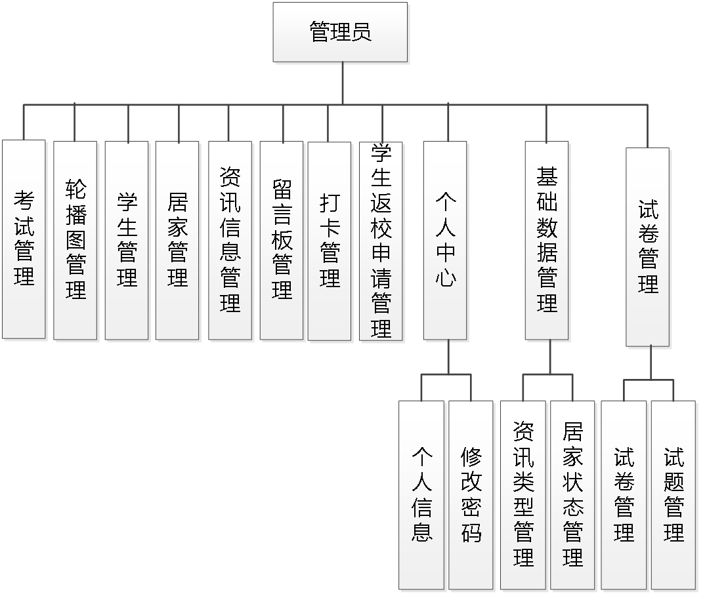
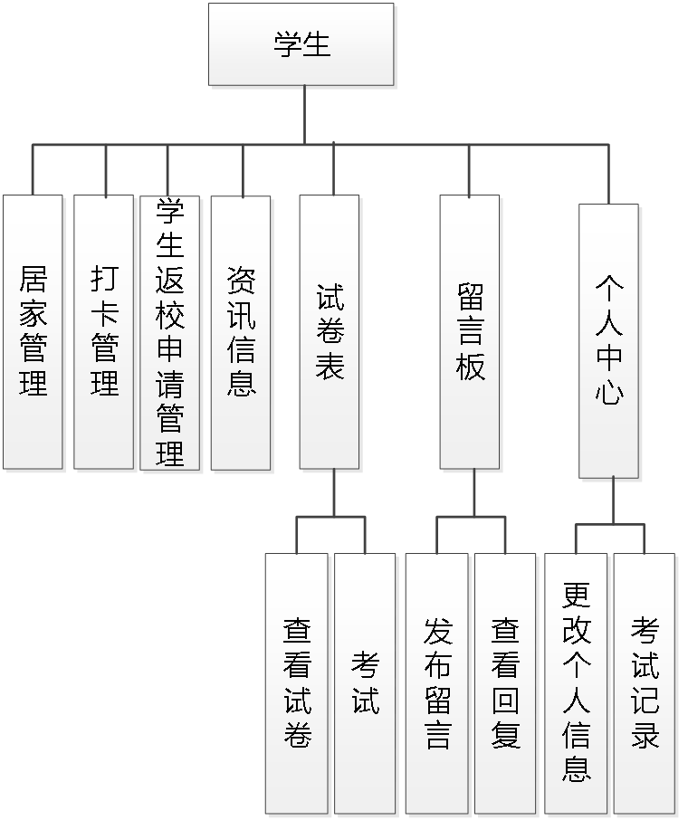
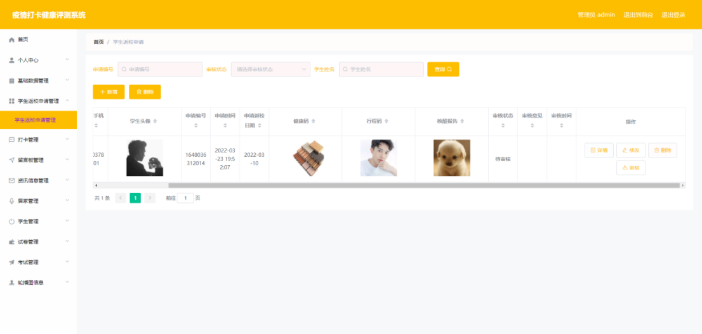
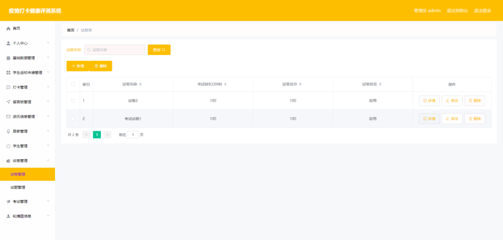
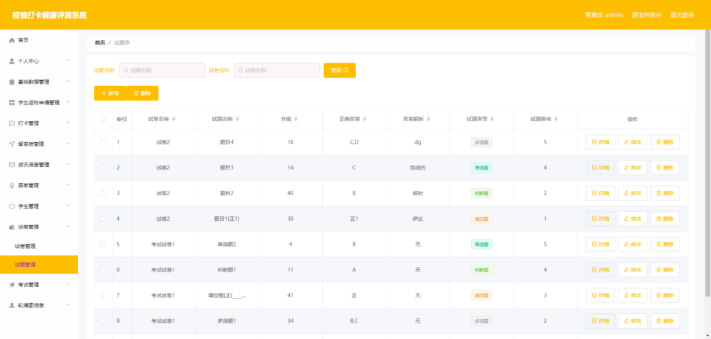
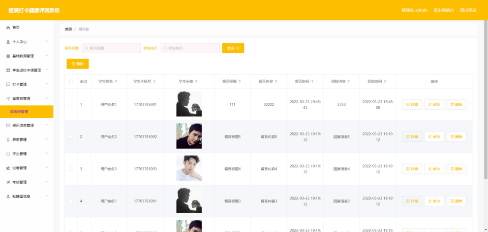
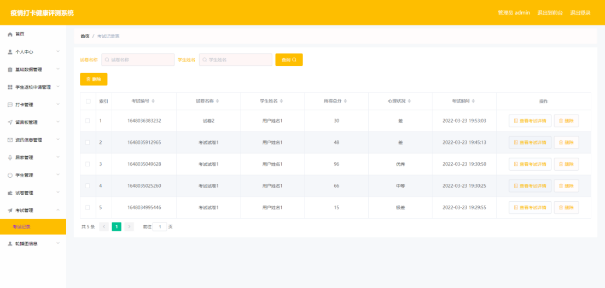
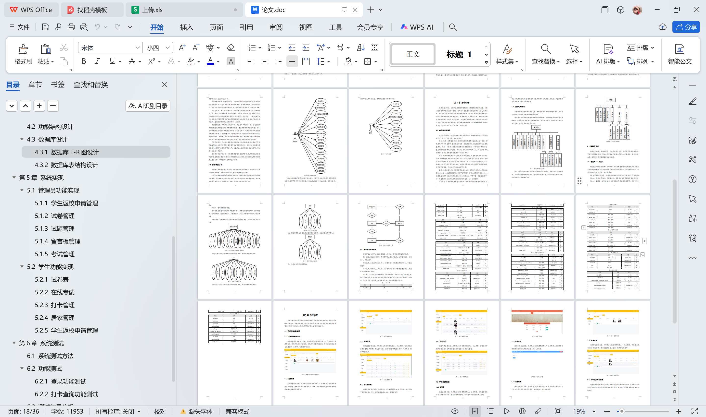

# springboot101-基于SpringBoot的疫情打卡健康评测系统

>  博主介绍：
>  Hey，我是程序员Chaers，一个专注于计算机领域的程序员
>  十年大厂程序员全栈开发‍ 日常分享项目经验 解决技术难题与技术推荐 承接各类网站设计，小程序开发，毕设等。
>  【计算机专业课程设计，毕业设计项目，Java，微信小程序，安卓APP都可以做，不仅仅是计算机专业，其它专业都可以】

## 3000套系统可挑选，获取链接：https://chaerspol.github.io/

<b>QQ【获取完整源码】：674456564</b>

<b>QQ群【获取完整源码】：1058861570</b>

### 系统架构

> 前端：html | js | css | jquery | vue
>
> 后端：springboot | mybatis
> 
> 环境：jdk1.8+ | mysql | maven

# 一、内容包括
包括有  项目源码+项目论文+数据库源码+答辩ppt+远程调试成功

# 二、运行环境

> jdk版本：1.8 及以上； ide工具：IDEA； 数据库: mysql5.7及以上；编程语言: Java

# 三、需求分析

**3.1 可行性分析**

系统的设计必须符合正常逻辑，所以设计之处，也需要从其他方面来论证其可行性。

**3.1.1 经济可行性**

开发疫情打卡健康评测系统，存在经济上面的支持，必须经济上的支持才可以有序进行，比如是否需要额外购买开发工具，购买开发电脑，或者从开发技术上是否是免费开源，达到的效果上面是否支出与收入不匹配，这些都需要进行分析。由于开发本系统，开发技术开源且稳定，电脑用正在使用的电脑就能满足，不需要太多的经济支出就可以达到目的，经济可行性通过。

**3.1.2 技术可行性**

疫情打卡健康评测系统软件主要用到的一些工具，而这些工具正好在学校就使用过，并且网上有很多免费的并且符合的开发工具，技术方面也学过，并且有图书馆的资源和网络资源可以充分利用。所以在技术角度上面来分析是可以的。

**3.1.3 操作可行性**

操作方面分为开发过程，实现过程，项目具体操作流程。这些因为都学过，并且有其他的项目流程作为参考。总体实现一般就是用户的登录相关，权限分配，基础数据的变更体现。让不同的角色有不同的操作界面，符合正确角色定位，使用者在操作上面并不会感觉到很突兀，影响操作流程。所以操作方面是可以的。
通过以上不同角度的分析，最后论证分析了可行性是没有问题的，完全可以进行后续步骤。

**3.2 系统流程分析**

操作逻辑是一个可以用画图工具展示的，因为数据在录入过程中的不可见，只能看到返回结果，所以把流程画成图可以更好的理解其中的顺序。
在系统的各项操作中，其他的录入环节，会对操作者具体操作的每条信息都会提出验证要求，比如不能为空，只能是汉字，以及其他的要求等，这些都在前端需要编写清楚，达到友好提示的目的，有效的帮助操作人员理解操作。具体数据的流程如下面的图所示。当操作员输入信息后，点击提交后台就会接收操作员提交的信息，并且提前编写好的逻辑会继续验证，如果数据合格就存入到数据库里并且返回成功提示，这样一个录入环节就达到了设计要求。

# 四、功能模块

在基于系统功能分析的基础之上，开始对系统的详细功能进行设计，最终将使用结构图的形式对设计的结果进行展示。管理员具备的详细功能将参照最终的设计结果，即下图所示的管理员功能结构图。其中管理员审核学生返校申请信息，管理学生居家，学生打卡，学生留言，试卷，试题以及学生考试信息等。

学生具备的详细功能将参照最终的设计结果，即下图所示的学生功能结构图。其中学生选择试卷进行考试，查看考试得分信息，添加学生返校申请信息，添加并管理打卡和居家信息。

# 五、效果图展示【部分效果图】

图5.1 学生返校申请管理界面【在该界面，管理员修改，删除学生返校申请信息，审核学生返校申请信息，学生返校申请信息包括健康码，行程码，核酸报告等信息】

图5.2 试卷管理界面【在该界面，管理员对试卷的考试时长，试卷总分等信息进行添加，修改，管理员查询试卷需要在查询框中编辑试卷名称即可查询】

图5.3 试题管理界面【在该界面，管理员负责新增多选题，判断题，单选题等信息，以及对各种试题进行排序，可以更改，删除试题信息等】

图5.4 留言板管理界面【在该界面，管理员除了需要回复留言之外，还可以查询留言内容，删除留言等】

图5.5 考试管理界面【在该界面，管理员对学生的答题情况以及学生答题试卷所得总分信息进行查看】

 <b>完整文章</b>
 
 
 

## 3000套系统可挑选，获取链接：https://chaerspol.github.io/

<b>QQ【获取完整源码】：674456564</b>

<b>QQ群【获取完整源码】：1058861570</b>

